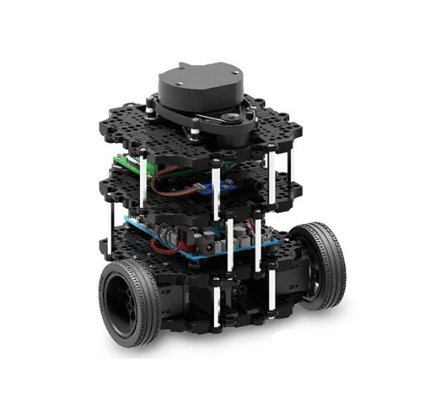
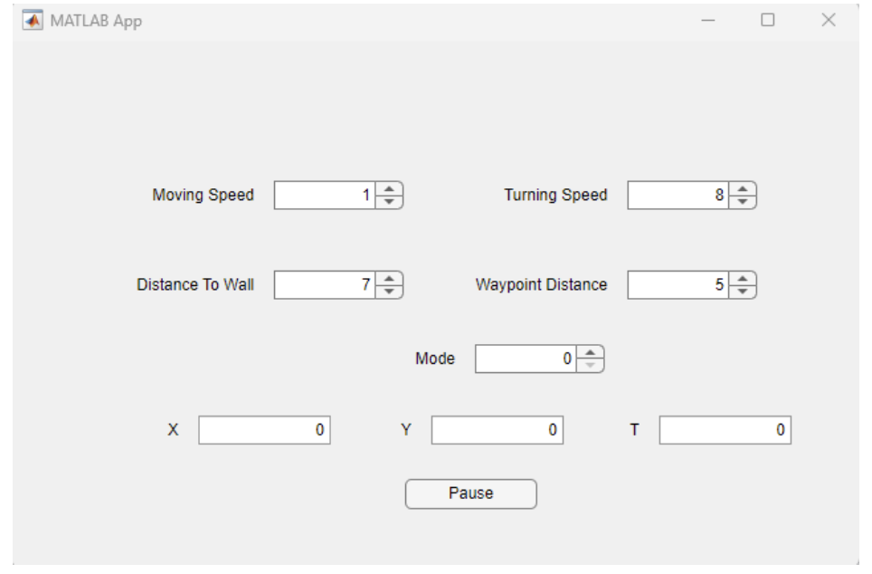
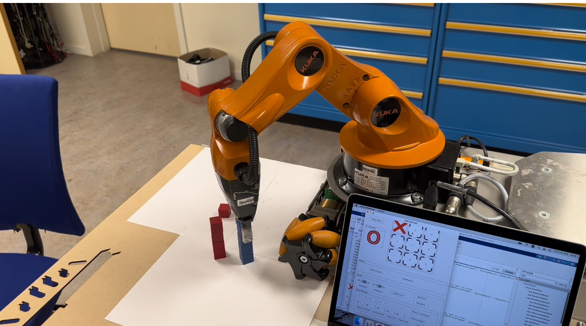
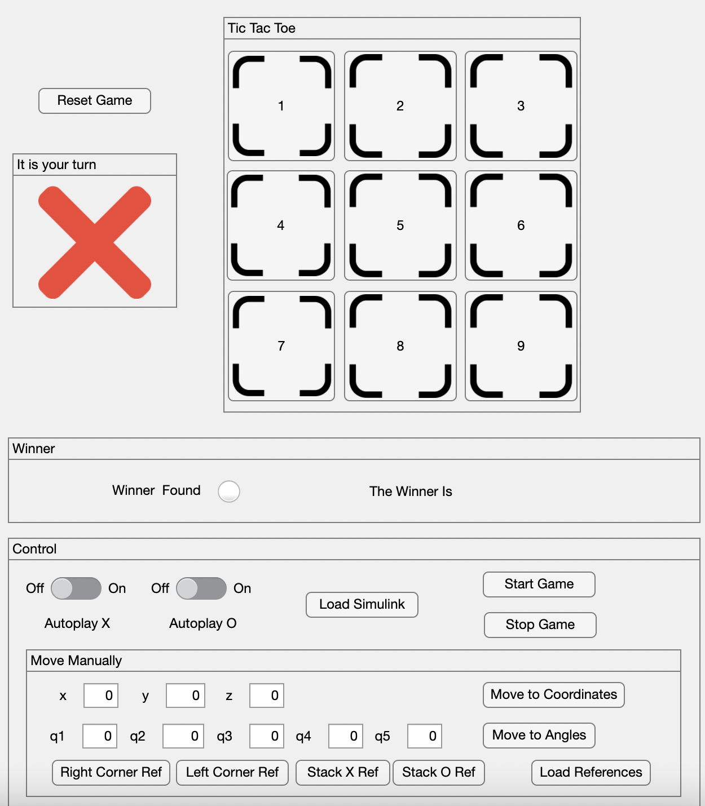
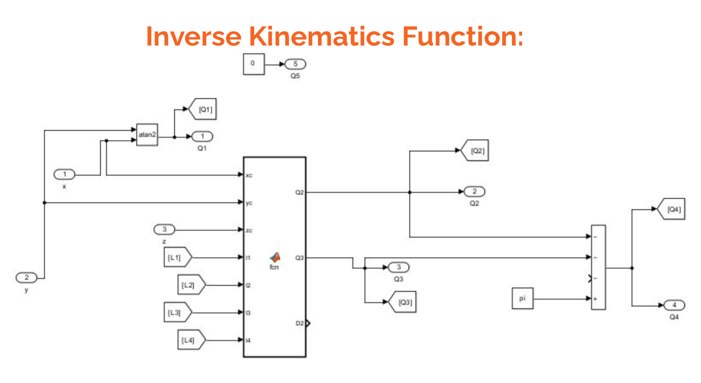

#  Programming Showcase

Welcome to **Zeyu's Programming Showcase** ! This repository contains several representative programming projects, including thesis code examples, and is intended to demonstrate as fully as possible my ability to program for different objects with different software and languages.

## Table of Contents
- [Thesis Code Examples](#thesis-code-examples)
- [Turtlebot Burger](#turtlebot-burger)
- [Wall-Fallowing Turtlebot](#wall-fallowing-turtlebot)
- [youBot For Tic-Tac-Toe](#youbot-for-tic-tac-toe)


## Thesis Code Examples

**Description:**  
This project, located in the `thesis_code_example` folder, contains part of the code examples of [my thesis](https://umu.diva-portal.org/smash/record.jsf?pid=diva2%3A1865447&dswid=-7877).  The examples show measurements for some of the models in the experiment, with the same approach applied to the rest of the models, whose similar approach are not repeated here.  
The models covered in this section correspond to the test files as follows:
- CBN and PatchGuard-bn: `mask_bn.py`
- DE-RS and PatchGuard-ds: `mask_ds.py`
- PatchGuard++: `det_bn.py`
- Backbone Inference Time: `test_acc.py`

The code in this part is based on the work of [Chong Xiang](https://github.com/inspire-group/PatchGuard). My work is based on the original work to modify the code according to the experiments I designed in order to adapt the experimental platform and measuring the  timing performance.  
Here are some examples of my work:
- **Adjusting and debugging:** _For example adjusting the device to run on a Raspberry Pi._
  ```python
  checkpoint = torch.load(os.path.join(MODEL_DIR,args.model+'_192_cifar.pth'), map_location='cpu')
- **Time measurement:** _Processing time measurements as described in the thesis._
  ```python
  import time as timer
  start_time = timer.time()
  # Code section to be measured
  end_time = timer.time()
  inference_time = start_time - end_time
  
## Turtlebot Burger

**Description:**  
  <p align="center">
  
  


This project, located in the `turtlebot_burger` folder, aims to utilize ROS 2 to make the bot to perform several tasks. The robot has three main functions, follow a wall (move along a wall without colliding with it), go to the determined point and remote control. The computer that was running the MATLAB script was communicating with the Turtlebot through WLAN and was using ROS 2 to control the robot. The Turtlebot_burger is a two wheel differential drive mobile robot with encoders in its drive motors, equipped with a LiDAR and IMU as sensors. The robot itself has sensor fusion which uses encoder and IMU data to calculate odometry able to publish the calculation results through a ROS topic in real time, same goes for LiDAR data.  

There were four main parts of the MATLAB script:
- `dnm1.m`  is the main part which calculates hough line and initiates other functions according to the selected operation mode.
- `myGo2.m` is the function which takes a point related to the robot and makes the robot got to that point.
- `myGo3.m` is the function which takes an angle input and makes the robot rotate that angle then start moving forward.
- `lab3app.mlapp` is the GUI where the user is able to set different parameters for the robot’s operation. There are three different operating modes (wall following, go to point and go to heading) and a pause button which makes the robot stop until the button is released.
  <p align="center">
  

## Wall-Fallowing Turtlebot

**Description:**  
This project, located in the `turtlebot_waffle` folder, aims to enable the turtlebot to follow the wall and avoid obstacles in both ROS2 simulation (both inside and outside wall of the house) and real life (in the maze which was set by the instructor). The bot has a lidar sensor available.  
The robot uses lidar readings for 2 angles, 0 degree forward and 60 degrees left, it has 3 operating modes and switches between these modes according to the readings of lidar:
- The first mode is activated when the forward distance reading is shorter than 60 cm, in this situation the robot rotates 90 degrees right and moves forward. This mode is used to follow walls with inside corners and avoid obstacles.
- The second mode is activated when the front sensor reading is longer than 60 cm and left sensor reading is below 80 cm, in this mode the robot steers to keep left distance reading at 50 cm and moves forward. This is the calculation for the steering angle:
(Left Distance Reading - 50cm) * 60
This mode is used to follow relatively straight walls.
- The third mode is activated when the front sensor reading is above 60 cm and left sensor reading is above 80 cm, in this mode the robot rotates 20 degrees left and moves forward. This mode is used when the robot arrives at the peak of an outside corner.

The code is first tested in turtlesim where the turtle was able to follow both the walls outside and inside the house. Then the code was modified for the turtlebot, lidar reading format was changed according to the range of the turtlebot (from 360 readings per cycle of turtlesim to 240 readings per cycle of turtlebot), also the frequency of the code was lowered for a more stable performance.


## youBot For Tic-Tac-Toe

**Description:**  
  <p align="center">
  

This project, located in the `youbot_chess` folder, aims to write a program which has a GUI running Tic-Tac-Toe game and an inverse kinematics function which controls a youBot arm imitating the game board in physical space by placing cubes of different colors on predefined cell areas. The game should also have a computer player option for both players. **The project was a team work and I was responsible for the inverse kinematics and GUI.**  
For the GUI, Matlab’s app designer is utilized, also robot arm’s movement sequences and computer players are implemented in this code. The Simulink model of the the Inverse Kinematics Functionis are modified so that it will take goal point data from GUI.
  <p align="center">

  <p align="center">
  
  

---

Thank you for checking out **Zeyu's Programming Showcase**! If you have any questions or suggestions, feel free to reach out.


